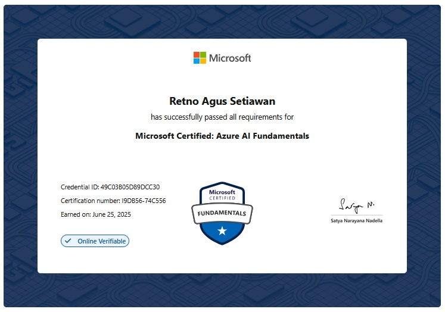

# AI-900 Exam Material

Selamat datang di repositori **AI-900 Exam Material**! 🎓  
Repositori ini dibuat untuk membantu siapa pun yang sedang mempersiapkan ujian sertifikasi Microsoft Azure AI Fundamentals (AI-900).

## 🧠 Tujuan Repositori

- Menyediakan ringkasan materi sesuai exam skills outline
- Menyajikan daftar soal dan pembahasan
- Menawarkan tips ujian dan strategi belajar

## 📚 Daftar Isi

- `syllabus-overview.md` – Ringkasan topik yang diuji
- `exam-materials/` – Soal ujian riil Exam AI-900
- `resources.md` – Daftar bacaan dan link dari Microsoft Learn
- `tips-and-tricks.md` – Tips menghadapi ujian online Pearson Vue dan belajar efektif

## 🎓 Credentials

## Bagian Akhir!
Selamat mempersiapkan Ujian AI-900!

Jika Anda merasa repositori ini bermanfaat, silakan tinggalkan bintang.

For more support: https://trakteer.id/retnoagus101/tip
